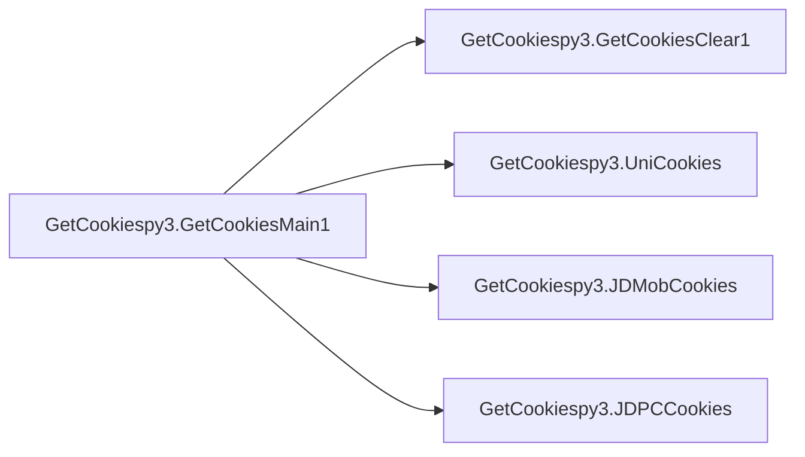
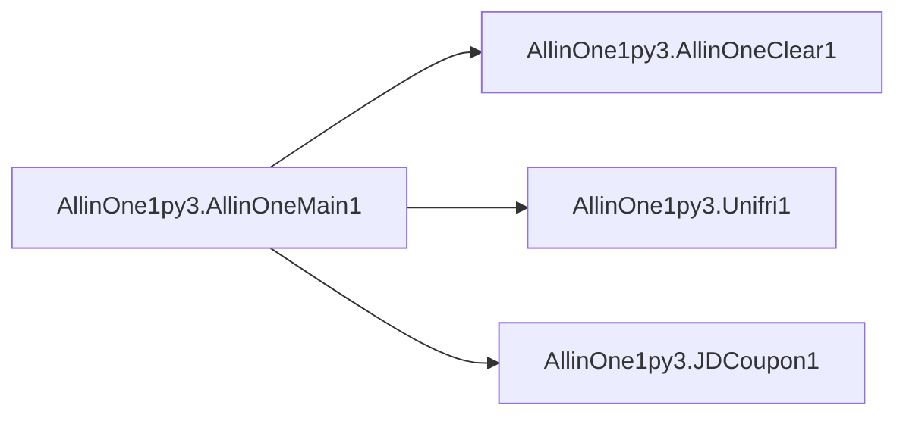

# Key Objects

[_Documentation generated by Documatic_](https://www.documatic.com)

<!---Documatic-section-GetCookiespy3.GetCookiesMain1-start--->
## GetCookiespy3.GetCookiesMain1

<!---Documatic-section-GetCookiesMain1-start--->


### Object Calls

* GetCookiespy3.GetCookiesClear1
* GetCookiespy3.UniCookies
* GetCookiespy3.JDMobCookies
* GetCookiespy3.JDPCCookies

<!---Documatic-block-GetCookiespy3.GetCookiesMain1-start--->
<details>
	<summary><code>GetCookiespy3.GetCookiesMain1</code> code snippet</summary>

```python
def GetCookiesMain1():
    funcl = ['1 获取联通Cookies', '2 获取京东手机端Cookies', '3 获取京东PC端Cookies']
    print('功能选择:\n\n' + '\n\n'.join(funcl))
    funcsel = input('\n更多整合等待发现,欢迎回复提供\n\n请输入对应数字然后按确定:')
    if funcsel == '' or funcsel == '0':
        funcsel = 1
        print('数字小于1,默认选择第一个 %s' % funcl[int(funcsel) - 1][2:])
        time.sleep(1)
    if len(funcl) - int(funcsel) >= 0:
        GetCookiesClear1()
        if int(funcsel) == 1:
            UniCookies().UniLogined()
        elif int(funcsel) == 2:
            JDMobCookies().JDMobLogined()
        elif int(funcsel) == 3:
            JDPCCookies().JDPCLogined()
    else:
        print('请输入仅列出的数字,1秒后重新输入')
        time.sleep(1)
        GetCookiesClear1()
        GetCookiesMain1()
```
</details>
<!---Documatic-block-GetCookiespy3.GetCookiesMain1-end--->
<!---Documatic-section-GetCookiesMain1-end--->

# #
<!---Documatic-section-GetCookiespy3.GetCookiesMain1-end--->

<!---Documatic-section-AllinOne1py3.AllinOneMain1-start--->
## AllinOne1py3.AllinOneMain1

<!---Documatic-section-AllinOneMain1-start--->


### Object Calls

* AllinOne1py3.AllinOneClear1
* AllinOne1py3.Unifri1
* AllinOne1py3.JDCoupon1

<!---Documatic-block-AllinOne1py3.AllinOneMain1-start--->
<details>
	<summary><code>AllinOne1py3.AllinOneMain1</code> code snippet</summary>

```python
def AllinOneMain1():
    funcl = ['1 联通超级星期五 (每周五10点起)', '2 京东抢任意优惠券']
    print('功能选择:\n\n' + '\n\n'.join(funcl))
    funcsel = input('\n更多整合等待发现,欢迎回复提供\n\n请输入对应数字然后按确定:')
    if funcsel == '' or funcsel == '0':
        funcsel = 1
        print('数字小于1,默认选择第一个 %s' % funcl[int(funcsel) - 1][2:])
        time.sleep(1)
    if len(funcl) - int(funcsel) >= 0:
        AllinOneClear1()
        if int(funcsel) == 1:
            Unifri1().UnifriMain1()
        elif int(funcsel) == 2:
            JDCoupon1().JDCouponMain1()
    else:
        print('请输入仅列出的数字,1秒后重新输入')
        time.sleep(1)
        AllinOneClear1()
        AllinOneMain1()
```
</details>
<!---Documatic-block-AllinOne1py3.AllinOneMain1-end--->
<!---Documatic-section-AllinOneMain1-end--->

# #
<!---Documatic-section-AllinOne1py3.AllinOneMain1-end--->

<!---Documatic-section-GetCookiespy3.GetCookiesExit1-start--->
## GetCookiespy3.GetCookiesExit1

<!---Documatic-section-GetCookiesExit1-start--->
<!---Documatic-block-GetCookiespy3.GetCookiesExit1-start--->
<details>
	<summary><code>GetCookiespy3.GetCookiesExit1</code> code snippet</summary>

```python
def GetCookiesExit1():
    print('程序5秒后自动退出')
    time.sleep(5)
    sys.exit()
```
</details>
<!---Documatic-block-GetCookiespy3.GetCookiesExit1-end--->
<!---Documatic-section-GetCookiesExit1-end--->

# #
<!---Documatic-section-GetCookiespy3.GetCookiesExit1-end--->

<!---Documatic-section-AllinOne1py3.AllinOneExit1-start--->
## AllinOne1py3.AllinOneExit1

<!---Documatic-section-AllinOneExit1-start--->
<!---Documatic-block-AllinOne1py3.AllinOneExit1-start--->
<details>
	<summary><code>AllinOne1py3.AllinOneExit1</code> code snippet</summary>

```python
def AllinOneExit1():
    print('\n程序5秒后自动退出')
    linecache.clearcache()
    time.sleep(5)
    sys.exit()
```
</details>
<!---Documatic-block-AllinOne1py3.AllinOneExit1-end--->
<!---Documatic-section-AllinOneExit1-end--->

# #
<!---Documatic-section-AllinOne1py3.AllinOneExit1-end--->

<!---Documatic-section-AllinOne1py3.AllinOneClear1-start--->
## AllinOne1py3.AllinOneClear1

<!---Documatic-section-AllinOneClear1-start--->
<!---Documatic-block-AllinOne1py3.AllinOneClear1-start--->
<details>
	<summary><code>AllinOne1py3.AllinOneClear1</code> code snippet</summary>

```python
def AllinOneClear1():
    if sys.platform == 'win32':
        os.system('cls')
    else:
        os.system('clear')
```
</details>
<!---Documatic-block-AllinOne1py3.AllinOneClear1-end--->
<!---Documatic-section-AllinOneClear1-end--->

# #
<!---Documatic-section-AllinOne1py3.AllinOneClear1-end--->

<!---Documatic-section-GetCookiespy3.GetCookiesClear1-start--->
## GetCookiespy3.GetCookiesClear1

<!---Documatic-section-GetCookiesClear1-start--->
<!---Documatic-block-GetCookiespy3.GetCookiesClear1-start--->
<details>
	<summary><code>GetCookiespy3.GetCookiesClear1</code> code snippet</summary>

```python
def GetCookiesClear1():
    if sys.platform == 'win32':
        os.system('cls')
    else:
        os.system('clear')
```
</details>
<!---Documatic-block-GetCookiespy3.GetCookiesClear1-end--->
<!---Documatic-section-GetCookiesClear1-end--->

# #
<!---Documatic-section-GetCookiespy3.GetCookiesClear1-end--->

[_Documentation generated by Documatic_](https://www.documatic.com)